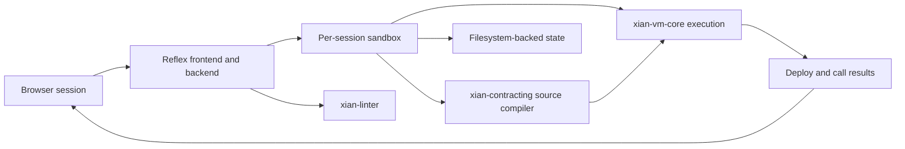

# xian-playground-web

`xian-playground-web` is the interactive in-browser playground for the
Xian contracting engine. Users author, lint, deploy, and call smart
contracts in the browser while the backend executes persisted `xian_vm_v1`
IR through `xian-vm-core` in a per-session sandbox. It is a developer test
surface, not a live node.

The app is built with [Reflex](https://reflex.dev/), so the backend is
Python and the frontend is generated and served by Reflex itself. State
(contract storage, metadata, UI snapshots) is filesystem-backed under
`playground/.sessions/`.

## Session Flow

Session cookies contain a server-issued session ID plus a browser-bound owner
secret. The visible session ID is not sufficient to adopt a session; sharing
uses a one-time resume token that rotates the owner secret when consumed.



## Quick Start

Install dependencies (sibling Xian repos must be present alongside this
checkout):

```bash
uv sync
```

The project resolves its Xian dependencies as editable sibling checkouts:

- `../xian-contracting` → `xian-tech-contracting`
- `../xian-contracting/packages/xian-vm-core` → `xian-tech-vm-core`
- `../xian-linter`      → `xian-tech-linter`
- `../xian-py`          → `xian-tech-py`

### Local development

```bash
uv run reflex run
```

Vite dev server with hot reload + a single backend worker. Reflex prints
the URL it binds to (typically `http://localhost:3000`).

### Production (single-port — recommended)

```bash
uv run reflex run --env prod --single-port \
  --frontend-port 8001 --backend-port 8001
```

A single Granian process serves both the static bundle and websocket /
events on port 8001.

### Production (split-port)

```bash
uv run reflex run --env prod
```

Frontend Sirv server on port 3000, backend on 8000. Front it with the
split-port nginx config below.

## Principles

- **Per-session Xian VM.** The backend compiles submitted source to
  validator-style `xian_vm_v1` IR and executes deploy/call requests through
  `xian-vm-core`, with isolated state on disk. There is no shared chain.
- **Single-process session manager.** Session metadata locks live in
  memory. Do not set `REFLEX_REDIS_URL` — multiple Reflex workers would
  corrupt the per-session filesystem state.
- **Submission rules match the chain.** User-submitted contracts follow
  current `submission` contract rules: names start with `con_`, are
  lowercase ASCII / digits / underscores, and ≤ 64 characters. The only
  exception is the system-contract path when the sandbox signer is
  explicitly `sys`.
- **Python 3.14.** `pyproject.toml`, `xian-tech-contracting`,
  `xian-tech-vm-core`, and `xian-tech-linter` pin the runtime.
- **Resource caps are configurable.** Upload sizes, activity-log size,
  session TTL, and worker RPC timeouts are tunable through environment
  variables (see below).

## Configuration

Environment variables:

| Variable                                | Purpose                                                            | Default       |
| --------------------------------------- | ------------------------------------------------------------------ | ------------- |
| `PLAYGROUND_STATE_IMPORT_MAX_BYTES`     | Maximum size of an uploaded state snapshot                         | 10 MB         |
| `PLAYGROUND_ACTIVITY_LOG_MAX_ENTRIES`   | Activity-log entries retained per session                          | 50            |
| `PLAYGROUND_SESSION_LOCK_IDLE_SECONDS`  | Idle TTL for cached session metadata locks                         | 600 s         |
| `PLAYGROUND_SESSION_LOCK_CACHE`         | Max session metadata locks held in memory (LRU eviction)           | 2048          |
| `PLAYGROUND_SESSION_TTL_SECONDS`        | Idle TTL before a session is deleted; `0` keeps sessions forever   | 7 d           |
| `PLAYGROUND_WORKER_RPC_TIMEOUT`         | Worker RPC timeout (seconds); `0` disables (not recommended)       | 30 s          |
| `PLAYGROUND_DEPLOY_URL`                 | Public frontend URL for deployed Reflex builds                     | local default |
| `PLAYGROUND_API_URL`                    | Public backend/event URL for deployed Reflex builds                | local default |
| `PLAYGROUND_FRONTEND_PORT`              | Default Reflex frontend port                                      | 3000          |
| `PLAYGROUND_BACKEND_PORT`               | Default Reflex backend port                                       | 8000          |

`rxconfig.py` declares the Reflex runtime config. The stock file works
for local dev; ports and env are overridden via CLI in production.

## Key Directories

- `playground/` — Reflex app:
  - `playground.py` — Reflex app entry, route registration.
  - `state.py` — UI / session state machine.
  - `components/` — UI components (editor, panels, dialogs).
  - `services/` — backend services (worker RPC, session manager,
    submission flow).
  - `middleware.py`, `defaults.py` — request middleware and defaults.
- `tests/unit/` — fast unit suite.
- `assets/` — static assets served by Reflex.
- `uploaded_files/` — runtime upload area.
- `pyproject.toml`, `uv.lock` — uv dependency configuration.
- `rxconfig.py` — Reflex runtime configuration.

## Reverse Proxy / Deployment Notes

- **Single-port mode** — forward every path (including `/_event`) to the
  chosen backend port and enable websocket headers.
- **Split-port mode** — send `/` to port 3000; proxy `/_event` and
  `/sessions` to port 8000 with `proxy_http_version 1.1`, `Upgrade`, and
  `Connection "upgrade"`.
- The CSP must include `'unsafe-eval'` in `script-src`. Reflex bundles
  (Monaco, Radix) rely on `new Function`; blocking it breaks hydration.
- All session state lives under `playground/.sessions/`. The runtime
  user must read/write that directory.
- Do **not** set `REFLEX_REDIS_URL` — Reflex would spawn multiple
  workers and corrupt the per-session filesystem state.

A complete example nginx config (single-port and split-port) and a
systemd unit are kept in this repo's git history; copy from the prior
README revisions when deploying.

## Validation

```bash
uv sync
uv run pytest tests/unit                                # fast unit tests
uv run pytest tests/integration -k <pattern>            # integration paths
uv run reflex run --env prod --frontend-only            # frontend-build smoke
```

## Troubleshooting

- Missing env vars: `rxconfig.py` raises `RuntimeError` naming the
  missing key. Double-check `.env`.
- Frontend build errors: verify Node ≥ 18 or Bun ≥ 1.1 is on `PATH`,
  then run `uv run reflex run --env prod --frontend-only` to see
  raw logs in `.web/`.
- Session cookie not set: confirm `PLAYGROUND_SESSION_COOKIE_SECURE=1`
  when serving over HTTPS.

## Requirements

- Python 3.14
- uv
- Node.js ≥ 18 or Bun ≥ 1.1 (Reflex builds the frontend)
- A compiler toolchain for transitive native dependencies (`make`,
  `gcc`, `pkg-config`)

## Related Docs

- [`../xian-contracting/README.md`](../xian-contracting/README.md) — compiler and VM packages used per session
- [`../xian-linter/README.md`](../xian-linter/README.md) — contract linter
- [`../xian-py/README.md`](../xian-py/README.md) — Python SDK
